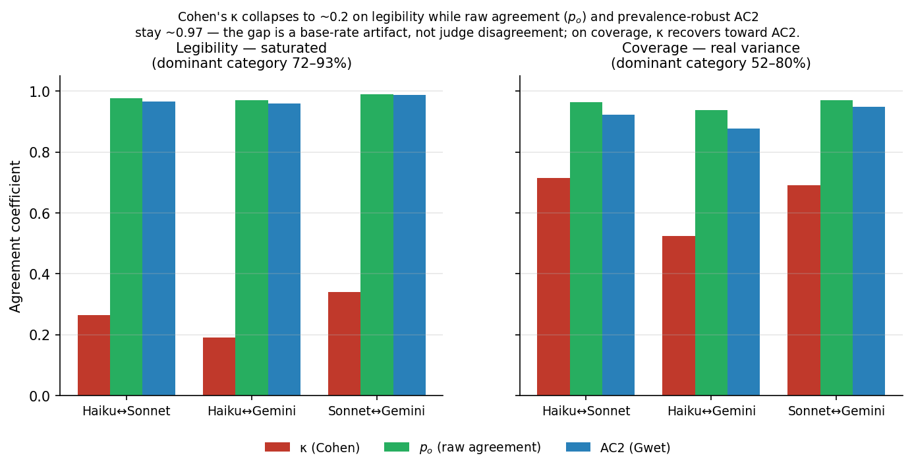

# When "judges disagree" on CoT monitorability — and when they don't

**TL;DR.** On saturated CoT-monitorability axes like frontier-model legibility, Cohen's κ collapses to ~0.2 and reads as judge disagreement, yet raw agreement (`p_o` ≈ 0.97) and a prevalence-robust coefficient (Gwet AC2 ≈ 0.96) show the judges agree on ~98% of items, so report a prevalence-robust coefficient and a saturation flag alongside κ before calling a monitorability metric judge-sensitive.

## The statistic is not new — the application is

This is the **Cohen's-κ prevalence paradox** (Feinstein & Cicchetti, 1990): when one
category dominates, κ's chance-correction term is inflated and κ goes low/negative
*despite* high observed agreement. **Gwet's AC1/AC2** (Gwet, 2008) is a standard
prevalence-robust alternative. Neither is our invention.

What we add is the **applied diagnostic**: a per-axis degeneracy check across
CoT-monitorability metrics — reporting κ, Gwet's AC1/AC2, raw observed agreement
`p_o`, and a per-judge dominant-category fraction together — plus reusable tooling
(`cotsuite.judges.gwet_ac1` / `observed_agreement`, and `judge_agreement` now emits
all four), and a corrective re-read of a Young-style "judges are unreliable on the
same traces" result. We do **not** claim the mechanism as a discovery.

## The data ($0 — re-analysis of committed scores, no new model calls)

Three judges (Claude Haiku 4.5, Claude Sonnet 4.6, Gemini 2.5 Pro) scoring the same
773 GPQA-Diamond chain-of-thoughts on Emmons & Zimmermann's (2510.23966) verbatim
Appendix-C legibility/coverage rubric (0–4):

| axis | judge pair | Cohen's κ | Gwet AC2 | p_o | dominant-fraction |
|---|---|--:|--:|--:|---|
| **legibility** | Haiku↔Sonnet | 0.26 | 0.97 | 0.98 | 0.72 / 0.89 / 0.93 — **all saturated** |
| | Haiku↔Gemini | **0.19** | **0.96** | **0.97** | |
| | Sonnet↔Gemini | 0.34 | 0.99 | 0.99 | |
| **coverage** | Haiku↔Sonnet | 0.71 | 0.92 | 0.96 | 0.52 / 0.68 / 0.80 |
| | Haiku↔Gemini | 0.52 | 0.88 | 0.94 | |
| | Sonnet↔Gemini | 0.69 | 0.95 | 0.97 | |

(dominant-fraction > 0.70 = degenerate; saturation flag.)

**Both directions, honestly:**
- **Legibility is saturated.** All three judges put ≥72% of CoTs in one category. κ
  reads 0.19–0.34 ("poor agreement"), but `p_o` = 0.97–0.99 and AC2 = 0.96–0.99: the
  judges agree on ~98% of items. The low κ is the paradox, not disagreement. (The
  same artifact drives the 36% legibility model-ranking "reversals" we also see —
  reorderings within a ~0.5-point band on a 4-point scale.)
- **Coverage has real variance.** Dominant-fraction 0.52–0.80; κ (0.52–0.71) sits
  close to AC2 and the rankings are judge-stable → genuine moderate-to-substantial
  agreement on the axis that actually discriminates.

## The applied claim

Report a prevalence-robust coefficient **and** a saturation flag next to κ before
concluding a monitorability metric is judge-sensitive. Frontier-model legibility —
exactly the "high monitorability by default" regime E&Z document — is the saturated
case where κ alone misleads. A judge-substitution that looks unreliable (κ=0.19) can
be a faithful substitute (p_o=0.97).

## Honest scope / what this is NOT

- **3 judges, one rubric (E&Z legibility/coverage), GPQA-family CoTs.** Not a broad
  claim across metrics or datasets yet.
- **Not** a reproduction of E&Z's Table 1 (different judges, single dataset).
- The statistic (κ-paradox, Gwet AC1) is textbook; the contribution is the applied
  per-axis diagnostic + the corrective re-read + the tooling.
- **Deferred (paper-grade, not in this artifact):** an artifact-vs-directional-
  disagreement decomposition (McNemar + bias/prevalence index), a K=2 binary metric
  at adequate N via generation, and the Young reversal re-analysis.

---

## Thread version

1/ "LLM judges disagree on CoT monitorability" is becoming a stylized fact, usually
shown with low Cohen's κ. Often that low κ is a base-rate artifact, not real
disagreement. Here's the check that tells them apart. 🧵

2/ Known stats first: this is the Cohen's-κ prevalence paradox (Feinstein-Cicchetti
1990) — when one score dominates, κ tanks even at high agreement. Gwet's AC1 (2008)
is the prevalence-robust fix. Not my invention; the application is.

3/ Setup ($0, re-analysis of committed data): 3 judges (Haiku-4.5, Sonnet-4.6,
Gemini-2.5-Pro) score 773 GPQA chain-of-thoughts on Emmons & Zimmermann's legibility
+ coverage rubric (0–4). I compute κ, Gwet AC2, raw agreement p_o, and a saturation
flag per axis.

4/ Legibility: κ = 0.19–0.34. Looks like the judges barely agree. But p_o = 0.97–0.99
and AC2 = 0.96–0.99 — they agree on ~98% of items. Every judge scores ≥72% of CoTs in
one bucket. The low κ is the paradox, not disagreement.

5/ Coverage (real variance, less saturated): κ = 0.52–0.71, close to AC2, rankings
judge-stable → genuine agreement. So κ *does* track agreement where there's spread —
it only breaks on the saturated axis.

6/ Why it matters: frontier-model legibility is exactly E&Z's "high monitorability by
default" regime — near-ceiling scores. That's where κ is least trustworthy. A judge
substitute that looks unreliable (κ=0.19) can be faithful (p_o=0.97).

7/ Takeaway: report a prevalence-robust coefficient + a saturation flag alongside κ
before calling a monitorability metric judge-sensitive. Tooling + the $0 re-analysis
are in cot-suite (`judges.gwet_ac1` / `observed_agreement`).

8/ Scope, honestly: 3 judges, one rubric, GPQA CoTs; not a Table-1 reproduction;
generalizing to binary metrics + a directional-disagreement decomposition is the next
step. The mechanism is textbook — the per-axis monitorability diagnostic is the point.
